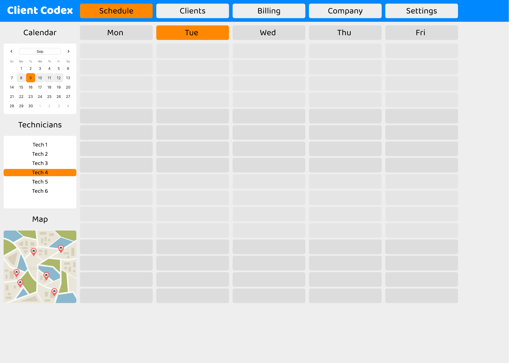

# Client Codex CRM

A field-service CRM for scheduling jobs and planning routes for multiple technicians.

## Mockup

Schedule view concept with a weekly calendar, technician selection, and map preview. Select the image to open the full-resolution PDF.

## Stack

- Bootstrap
- Python and Flask
- SQLAlchemy and SQLite
- Leaflet and OpenStreetMap
- OSRM routing

## Planned Features

- Customers and service locations
- Technicians and availability
- Jobs and appointments
- Scheduling calendar with conflict detection
- Daily technician routes displayed on a map
- Python-based job assignment and route ordering

## Roadmap

1. Build the Bootstrap layout.
2. Set up Flask and SQLite.
3. Add customers and service locations.
4. Add technicians, jobs, and appointments.
5. Build the scheduling calendar.
6. Add maps and route planning.
7. Explore AI-assisted scheduling.

Google Calendar synchronization can be added later but is not required for the core application.
